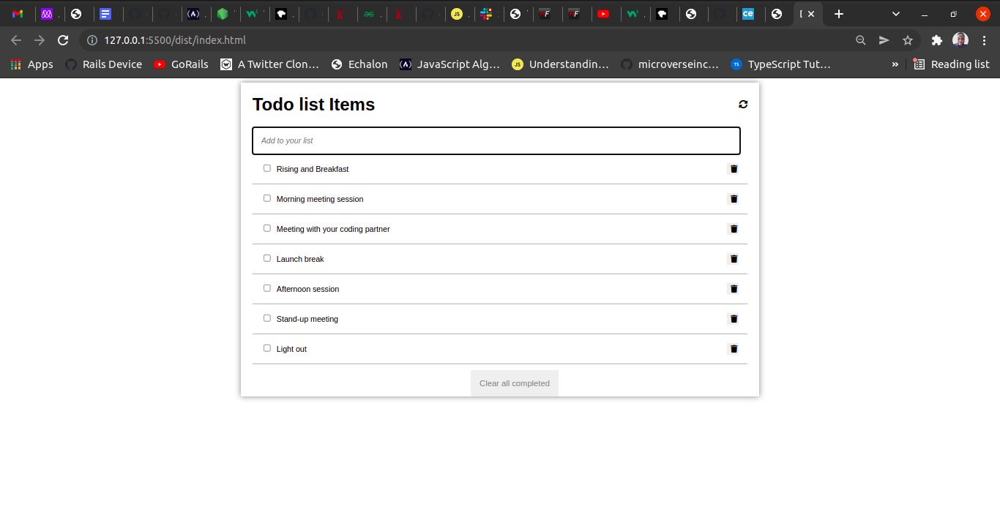

# To-Do List App

# To-Do List App with Webpack

> Description of the project.

In this project, i created the structure of a to-do list app.

## Built With

- Major languages
  HTML
  CSS
  JavaScript

- Frameworks
  None

- Technologies used
  Use of webpack and ES6 syntax.

## Live Demo (if available)

[Live Demo Link](https://charlyeneh.github.io/To-Do-App/dist/)
## Getting Started

Clone the Repo and power on the live-server to view the page or click on the live demo link.

To get a local copy up and running follow these simple example steps.

### Prerequisites
  Install a code editor and have a working browser.
### Setup
  Clone the Repo and power up the live-server to view the project on your browser.
### Install
  Install a code editor and a browser.
  Install a packege manager - npm.
### Usage
  This App can be used to keep track of daily activities.
### Deployment
  This App was deployed using the github apps deployment. But you can use other options.

## Author

👤 **Eneh Charles Chukwunweike**

- GitHub: [@charlyeneh](https://github.com/charlyeneh)
- Twitter: [@twitterhandle](https://twitter.com/ProgrammerBaby?s=09)
- LinkedIn: [LinkedIn](https://www.linkedin.com/in/charles-chukwunweike-eneh-5345a2147)

## 🤝 Contributing

Contributions, issues, and feature requests are welcome!

Feel free to check the [issues page](https://github.com/charlyeneh/To-do_App/issues).

## Show your support

Give a ⭐️ if you like this project!

## Acknowledgments

- Hat tip to anyone whose code was used
- Inspiration
- etc

## 📝 License

